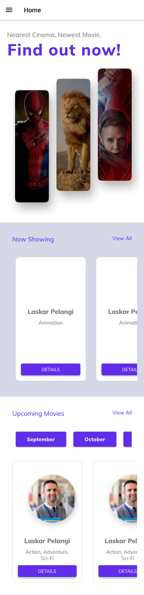
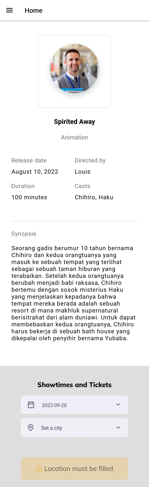
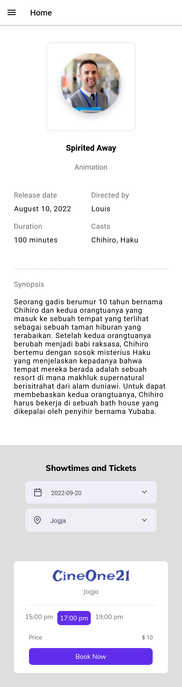
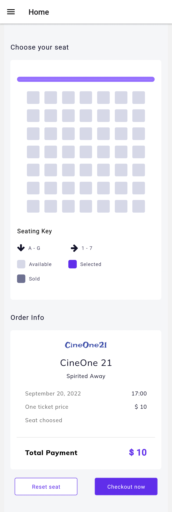
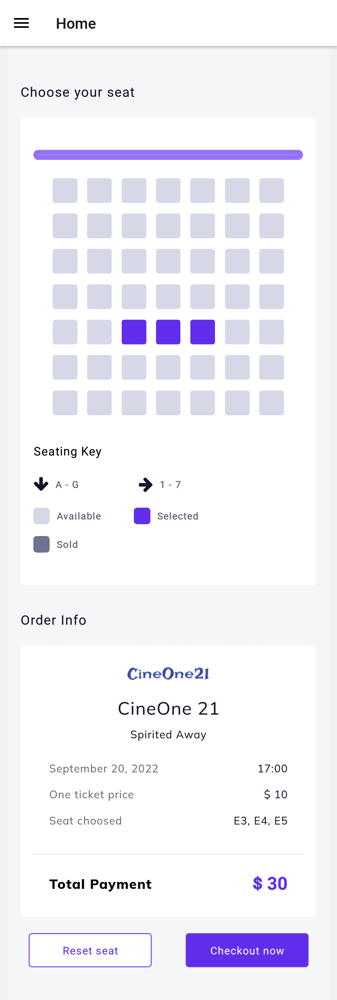

<!-- Improved compatibility of back to top link: See: https://github.com/othneildrew/Best-README-Template/pull/73 -->
<a name="readme-top"></a>
<!--
*** Thanks for checking out the Best-README-Template. If you have a suggestion
*** that would make this better, please fork the repo and create a pull request
*** or simply open an issue with the tag "enhancement".
*** Don't forget to give the project a star!
*** Thanks again! Now go create something AMAZING! :D
-->


<!-- PROJECT SHIELDS -->
<!--
*** I'm using markdown "reference style" links for readability.
*** Reference links are enclosed in brackets [ ] instead of parentheses ( ).
*** See the bottom of this document for the declaration of the reference variables
*** for contributors-url, forks-url, etc. This is an optional, concise syntax you may use.
*** https://www.markdownguide.org/basic-syntax/#reference-style-links
-->
[![Contributors][contributors-shield]][contributors-url]
[![Forks][forks-shield]][forks-url]
[![Stargazers][stars-shield]][stars-url]
[![LinkedIn][linkedin-shield]][linkedin-url]


<!-- PROJECT LOGO -->
<br />
<div align="center">
  <a href="https://github.com/Novianaa/mobile_tickitz">
    
  </a>

<h3 align="center">Tickitz</h3>

  <p align="center">
    Booking ticket cinema
    <br />
    <a href="https://github.com/Novianaa/mobile_tickitz"><strong>Explore the docs »</strong></a>
    </p>
</div>


<!-- TABLE OF CONTENTS -->
<details>
  <summary>Table of Contents</summary>
  <ol>
    <li>
      <a href="#about-the-project">About The Project</a>
      <ul>
        <li><a href="#built-with">Built With</a></li>
      </ul>
    </li>
    <li>
      <a href="#getting-started">Getting Started</a>
      <ul>
        <li><a href="#relation">Relation</a></li>
        <li><a href="#installation">Installation</a></li>
      </ul>
    </li>
    <li><a href="#usage">Usage</a></li>
    <li><a href="#contact">Contact</a></li>
  </ol>
</details>


<!-- ABOUT THE PROJECT -->
## About The Project

[![Product Name Screen Shot][product-screenshot]](https://example.com)

I development a web service for a cinema ticket booking system, where the user will be able to select a film based on the show schedule and location, after that the user can choose the seat to be occupied while watching.

<p align="right">(<a href="#readme-top">back to top</a>)</p>


### Built With

* [React Navite](https://reactnative.dev/)
* [React Navigation](https://reactnavigation.org/)
* [NodeJS](https://nodejs.org)
* [axios](https://www.npmjs.com/package/axios)
* [react-redux](https://www.npmjs.com/package/react-redux)
* [redux](https://www.npmjs.com/package/redux)
* [redux-persist](https://www.npmjs.com/package/redux-persist)


<p align="right">(<a href="#readme-top">back to top</a>)</p>


<!-- GETTING STARTED -->
## Getting Started<hr />

### Relation
[Backend Tickitz](https://github.com/Novianaa/Backend-Tickitz)
[Tickitz Web](https://github.com/Novianaa/tickitz-fe)

### Installation

1. Clone the repo
   ```sh
   git clone https://github.com/Novianaa/mobile_tickitz.git
   ```
2. Install NPM packages
   ```sh
   npm install
   ```
3. Then, you can running this project with the command belo
   ```js
   npm run android
   ```

<p align="right">(<a href="#readme-top">back to top</a>)</p>


<!-- USAGE EXAMPLES -->
## Usage
[Link download app](https://bit.ly/novia-tickitz)

| Screen name                             | Screenshot                                                  |
| --------------------------------------- | ----------------------------------------------------------- |
| Home                                    |             |
| Detail Movie if haven't chosen Location |  |
| Detail Movie                            |  |
| Booking if haven't chosen seat          |      |
| Booking if haven't chosen seat          |     |


<p align="right">(<a href="#readme-top">back to top</a>)</p>


## Contact

Noviana Rahmawati -  noviana.rahmawati80@gmail.com

Project Link: [https://github.com/Novianaa/mobile_tickitz](https://github.com/Novianaa/mobile_tickitz)

<p align="right">(<a href="#readme-top">back to top</a>)</p>


<!-- MARKDOWN LINKS & IMAGES -->
<!-- https://www.markdownguide.org/basic-syntax/#reference-style-links -->
[contributors-shield]: https://img.shields.io/github/contributors/Novianaa/mobile_tickitz.svg?style=for-the-badge
[contributors-url]: https://github.com/Novianaa/mobile_tickitz/graphs/contributors
[forks-shield]: https://img.shields.io/github/forks/Novianaa/mobile_tickitz.svg?style=for-the-badge
[forks-url]: https://github.com/Novianaa/mobile_tickitz/network/members
[stars-shield]: https://img.shields.io/github/stars/Novianaa/mobile_tickitz.svg?style=for-the-badge
[stars-url]: https://github.com/Novianaa/mobile_tickitz/stargazers
[linkedin-shield]: https://img.shields.io/badge/-LinkedIn-black.svg?style=for-the-badge&logo=linkedin&colorB=555
[linkedin-url]: https://www.linkedin.com/in/noviana-rahmawati08/
[product-screenshot]: images/screenshot.png
